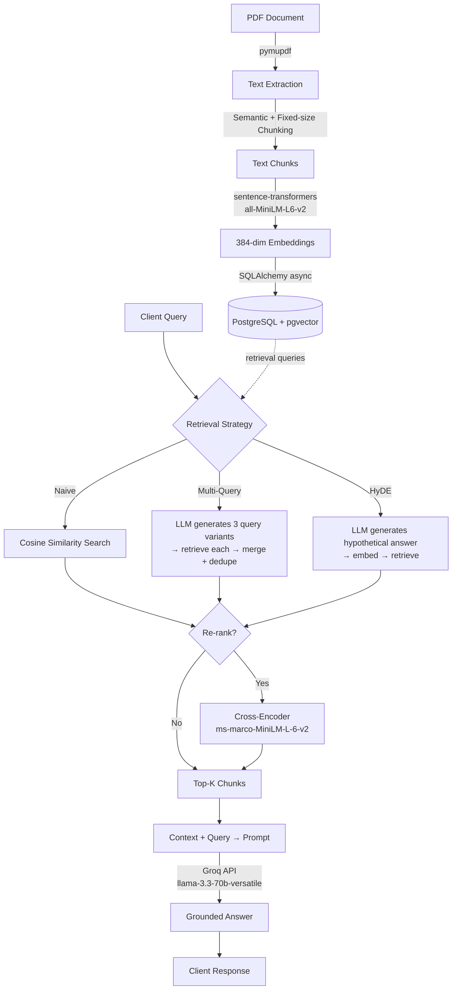

# Vertical API Sprint — Production RAG Pipeline

An async FastAPI backend implementing a configurable Retrieval-Augmented Generation (RAG) system — from raw PDF ingestion to a live `/ask` endpoint supporting three distinct retrieval strategies (naive, multi-query, HyDE) with optional cross-encoder re-ranking.

Built as a hands-on deep dive into production-grade GenAI engineering: async database access, containerized deployment, vector search, and LLM orchestration — not a notebook demo.

---

## Architecture



---

## Tech Stack

| Layer | Technology | Why |
|---|---|---|
| API Framework | FastAPI (async) | Native async support for I/O-bound DB and LLM calls |
| Database | PostgreSQL + pgvector | Reused existing infra instead of adding a dedicated vector DB — one less moving part to operate |
| ORM | SQLAlchemy (async) + asyncpg | Non-blocking DB access under concurrent load |
| Embeddings | sentence-transformers (`all-MiniLM-L6-v2`) | 384-dim, CPU-friendly, no external API dependency for ingestion |
| Re-ranker | CrossEncoder (`ms-marco-MiniLM-L-6-v2`) | Second-stage precision on top candidates |
| LLM | Groq (`llama-3.3-70b-versatile`) | Fast inference, free tier suitable for iteration |
| PDF Parsing | PyMuPDF | Reliable text extraction |
| Containerization | Docker + Docker Compose | Multi-stage build; app + DB networked as isolated services |
| Load Testing | Locust | Validated async performance under concurrent load |
| Logging | structlog | Structured JSON logs for observability |

---

## Setup

**Prerequisites:** Docker Desktop, a Groq API key ([console.groq.com](https://console.groq.com))

1. Clone the repo and create a `.env` file in the project root:
    ```env
    DATABASE_URL=postgresql+asyncpg://postgres:password123@db:5432/todo_db
    POSTGRES_USER=postgres
    POSTGRES_PASSWORD=password123
    POSTGRES_DB=todo_db
    GROQ_API_KEY=your_groq_api_key_here
    ```

2. Build and start the containers:
    ```bash
    docker-compose up -d --build
    ```

3. Enable the `pgvector` extension (one-time, inside the `db` container):
    ```bash
    docker-compose exec db psql -U postgres -d todo_db -c "CREATE EXTENSION IF NOT EXISTS vector;"
    ```

4. Create the tables:
    ```bash
    docker-compose exec api python init_db.py
    ```

5. Ingest a document (place a PDF in `data/`, update the path in `ingest.py`):
    ```bash
    docker-compose exec api python ingest.py
    ```

6. Open the interactive API docs:
    ```
    http://localhost:8000/docs
    ```

---

## API

### `POST /ask`

Ask a question grounded in the ingested document(s).

**Request body:**
```json
{
  "query": "What does the document say about cancellation policy?",
  "use_multi_query": false,
  "use_hyde": false,
  "use_rerank": false
}
```

**Response:**
```json
{
  "query": "What does the document say about cancellation policy?",
  "answer": "Based on the provided context, ..."
}
```

Retrieval strategy flags are mutually configurable — pick one per request to compare quality/latency trade-offs (see [Design Decisions](#design-decisions)).

### CRUD Resource — `/todos`

Standard async CRUD (`GET`, `POST`, `PUT`, `DELETE`) built first as the foundational async/DB/Docker skeleton before the RAG layer was added. Retained as a working reference for the base infrastructure.

---

## Design Decisions & Tradeoffs

**Why pgvector instead of a dedicated vector DB (Pinecone, Weaviate, Qdrant)?**
The project already runs PostgreSQL for relational data. Adding a second database system for vectors alone introduces operational overhead (separate connection pooling, separate backup strategy, separate failure mode) without a clear win at this data scale. `pgvector` keeps the stack to one database to reason about — a deliberate choice, not a default.

**Why semantic chunking over pure fixed-size?**
Fixed-size chunking was implemented and tested first, but it splits mid-sentence and mid-paragraph, degrading retrieval quality. Semantic (paragraph-aware) chunking preserves natural context boundaries. A fallback to fixed-size splitting was added for any single paragraph that exceeds the max chunk size on its own, so the pipeline doesn't silently produce one giant chunk for poorly-formatted source text — a real bug hit during development (see below).

**Why three retrieval strategies instead of one?**
- **Naive (cosine similarity)** is the fast default — good enough when the query phrasing is close to the document's phrasing.
- **Multi-query** generates phrasing variations via the LLM before retrieving, improving recall when a user's wording doesn't match the document's vocabulary.
- **HyDE** retrieves using an embedded *hypothetical answer* rather than the raw question — answer-shaped text often matches document content better than question-shaped text.

Each is a different bet on where retrieval fails; exposing all three as a runtime flag (rather than hardcoding one) makes the tradeoffs explicit and testable per query.

**Why cross-encoder re-ranking as a separate, optional stage?**
Cosine similarity over embeddings is fast but approximate — it scores query and chunk independently. A cross-encoder scores them *jointly*, which is more accurate but too slow to run over the full corpus. The pipeline therefore over-fetches a wider candidate pool (default 15) via cosine similarity, then re-ranks only that pool down to the final top-k — a standard two-stage retrieval pattern that balances speed and precision.

**Why low temperature (0.2) for answer generation but higher (0.5–0.7) for query variation / HyDE generation?**
Answer generation needs to stay grounded and low-variance — the prompt explicitly instructs the model to say when an answer isn't in the context, and low temperature reduces hallucination risk. Query variation and hypothetical-answer generation benefit from more diversity, since the goal there is broader retrieval coverage, not a single correct output.

---

## A Real Bug Worth Documenting

Early ingestion runs stored the entire ~300-page document as a **single row** in `document_chunks`. Root cause: the semantic chunker split on double newlines (`\n\n`), but the PDF's extracted text didn't consistently contain them — so the whole document was treated as one giant "paragraph" and never split. Retrieval consequently returned the same top result for every query, regardless of relevance.

Fix: any single paragraph exceeding `max_chunk_size` now falls through to fixed-size sub-chunking rather than being kept whole. Re-ingesting after the fix produced 1,319 distinct chunks and resolved retrieval accuracy immediately.

This is included deliberately — it's the kind of failure mode that's easy to miss without explicitly checking chunk counts post-ingestion, and worth being able to speak to in an interview.

---

## Production Considerations

- **Environment-based configuration:** DB credentials and the Groq API key are injected via `.env` / Docker Compose environment variables, never hardcoded.
- **Async throughout:** DB access (SQLAlchemy async + asyncpg) and endpoint handlers are non-blocking, validated under concurrent load with Locust (0 failures, ~10ms median response time on CRUD endpoints).
- **Structured logging:** JSON-formatted logs via `structlog` for downstream log aggregation compatibility.
- **Isolated containers:** App and database run as separate networked Docker Compose services with a persistent volume, so database state survives container restarts.

---

## Future Improvements

- RAGAS-based evaluation harness (faithfulness, context precision/recall) against a fixed golden Q&A set
- Response caching (Redis) for repeated queries
- Cost/latency dashboard per retrieval strategy
- CI pipeline to auto-build and push the Docker image on merge to `main`

---

## Local Development Reference

```bash
# Start everything
docker-compose up -d --build

# Run a one-off script inside the running api container
docker-compose exec api python ingest.py
docker-compose exec api python retrieve.py

# Connect to the DB directly
docker-compose exec db psql -U postgres -d todo_db

# Tear down (add -v to also wipe the volume/data)
docker-compose down
```
